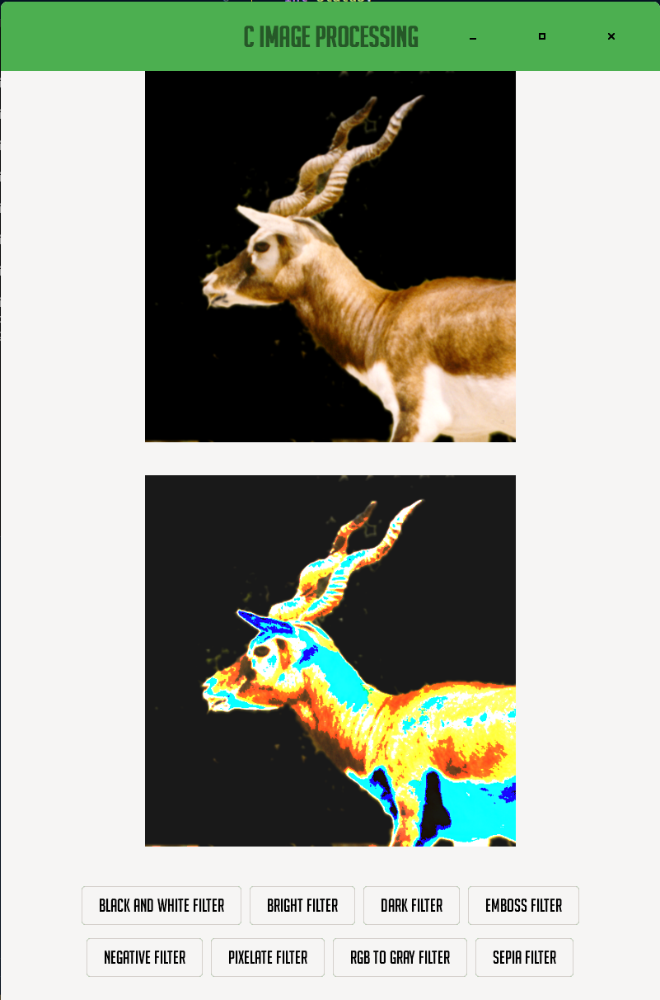
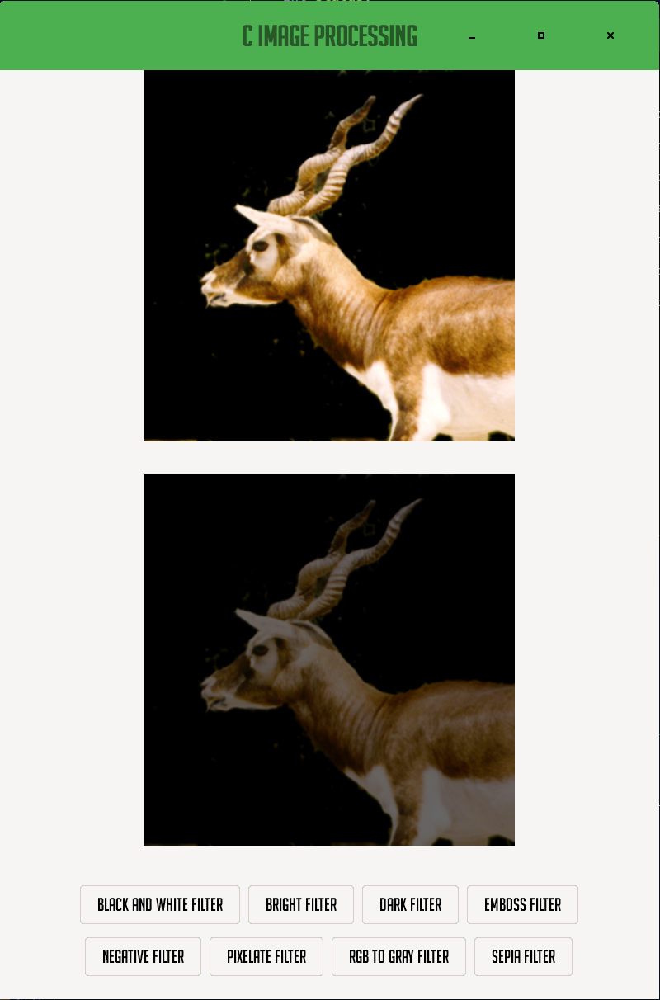
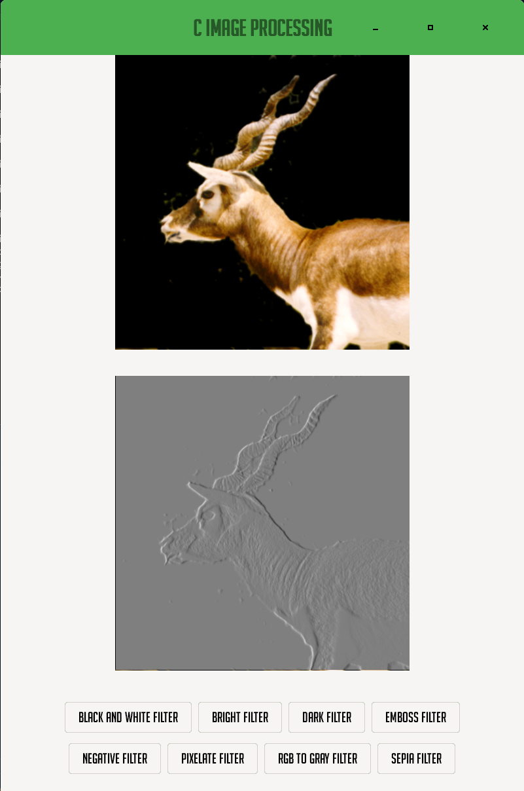
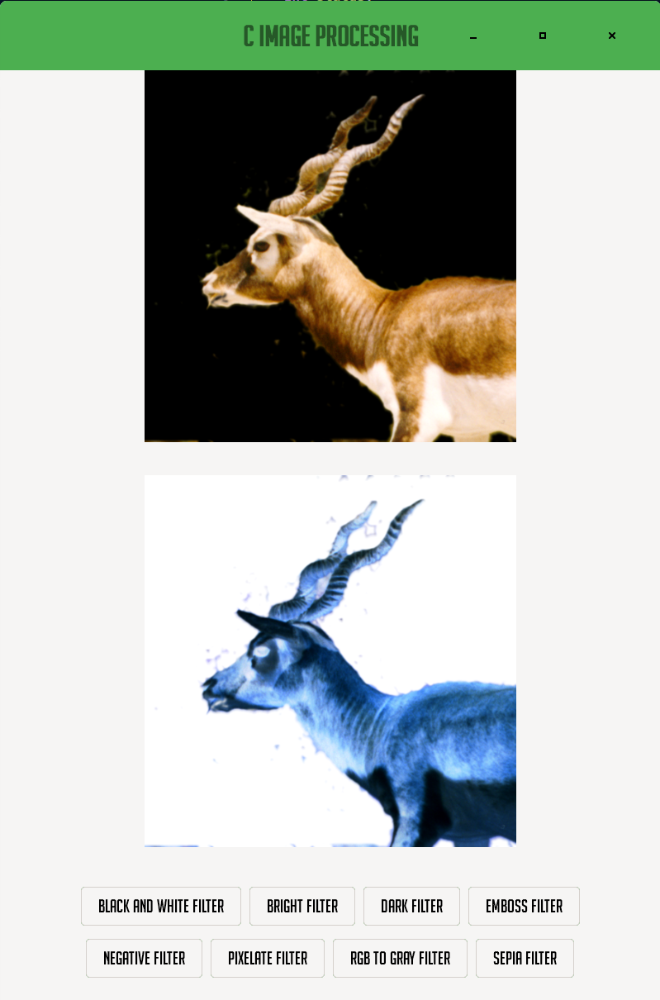
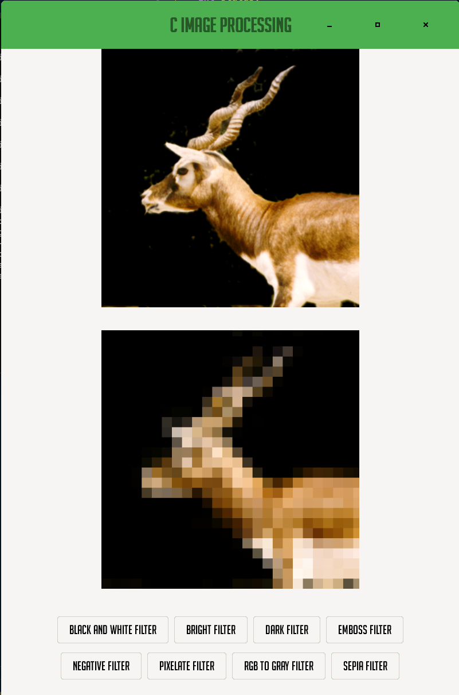
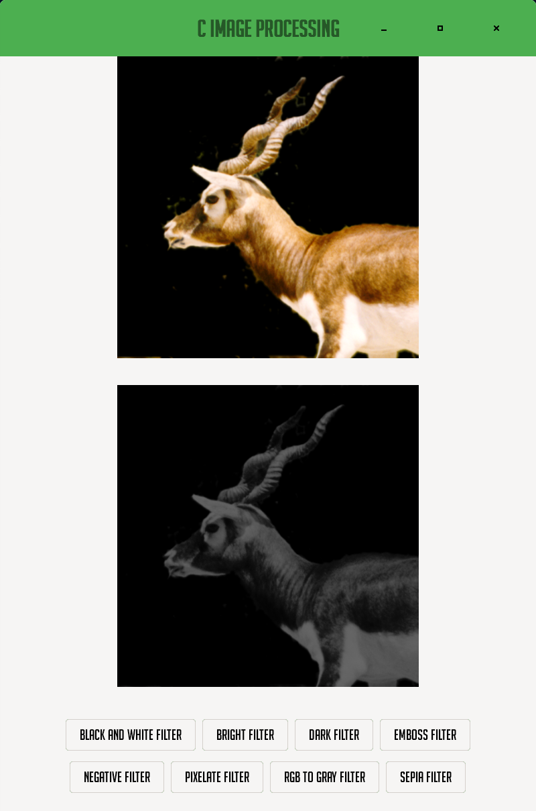
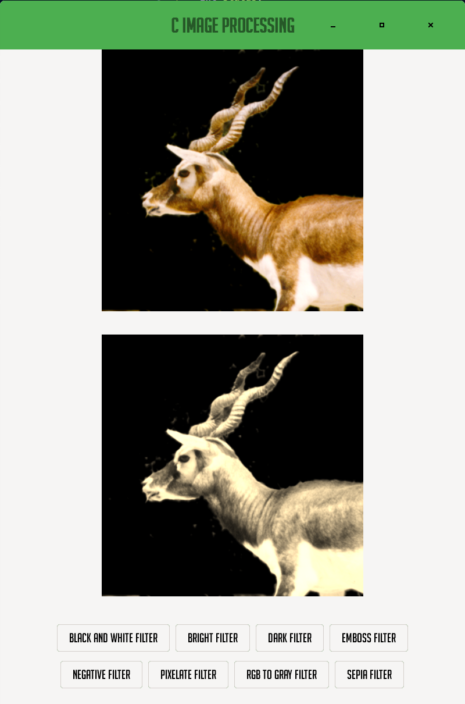

# C Image Processing

    
    
    
    
    
    
    
    

This program is to builds a simple library of image processing functions in C. The library is then used to create a program that can read in an image (in multiple formats including BMP, PDF & JPEG), apply a filter to it, and then write the modified image to a new file.

# Fonts

The fonts used in this program, are available here:

<a href="https://www.dafont.com/bignoodletitling.font">
    Big Noodle Titling
</a>

# Contribution

If you'd like to contribute to `c_image_processing` please submit a pull-request on a feature branch.

# Installing

Clone the repo:

    git clone https://github.com/VerzatileDevOrg/C_image_processing

    cd c_image_processing
